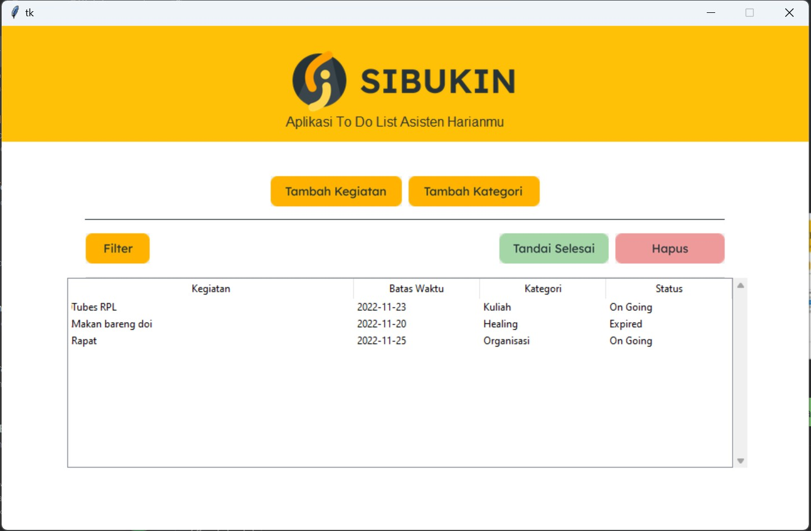
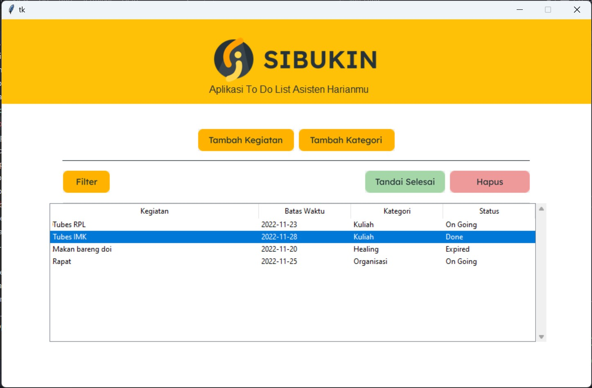
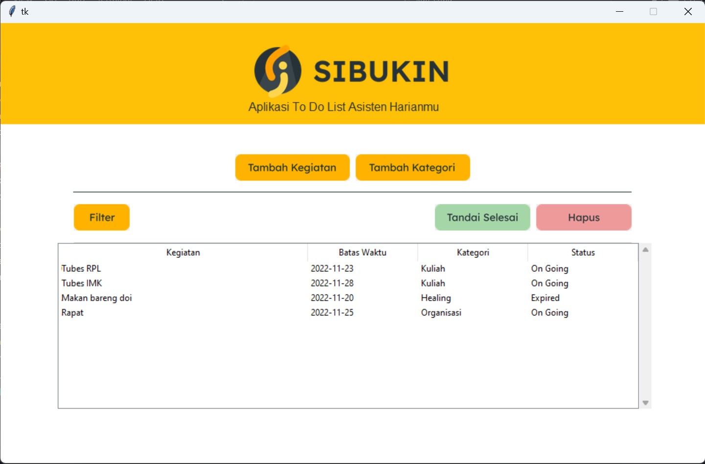
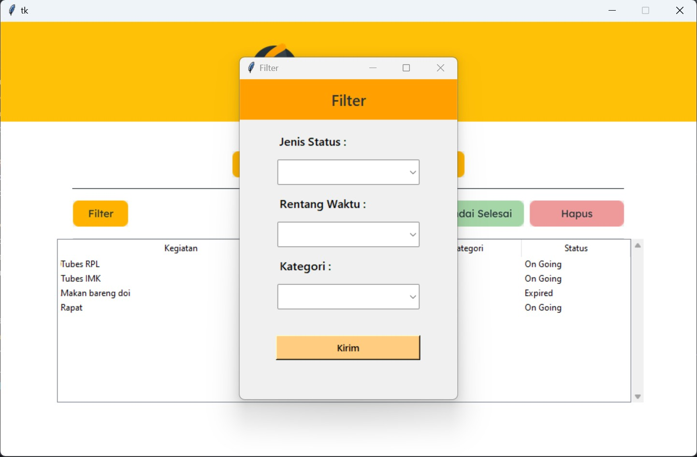
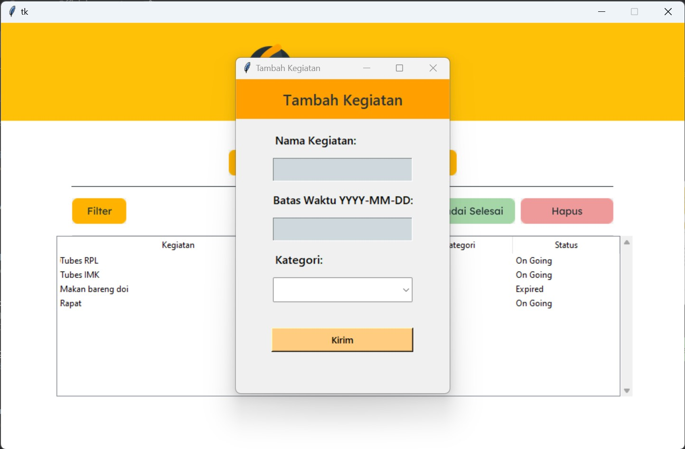
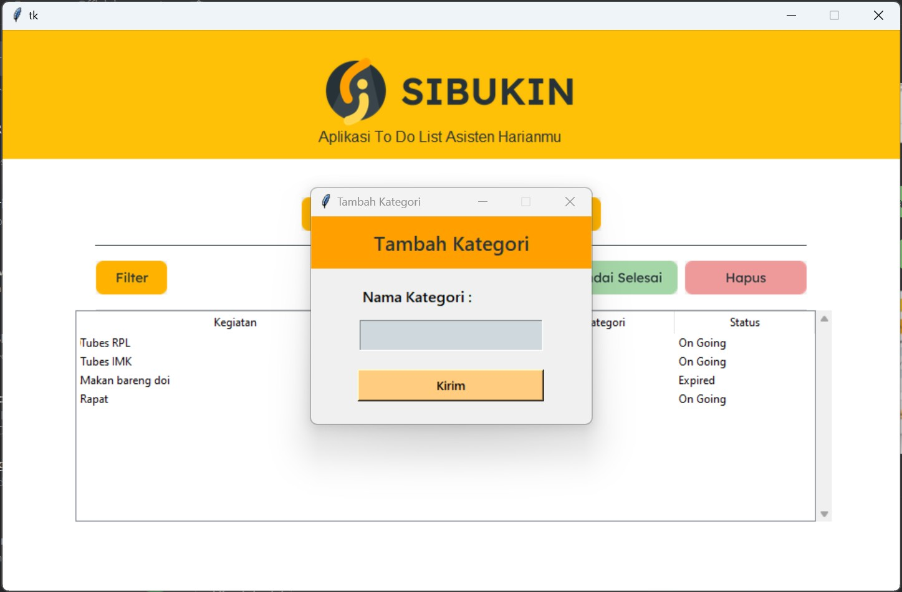

# IF3152-2022-K02-AfkarPirates-SIBUKIN

Implementasi Tugas Besar IF3152 - Rekayasa Perangkat Lunak STI berupa aplikasi to-do-list

**Tentang Aplikasi**
SIBUKIN (Sistem Informasi Bukti Iterative Listing) merupakan aplikasi _to-do-list_ offline dengan memanfaatkan database lokal untuk membantu _user_ lebih produktif.

**Cara Menjalankan Program**

1. Install python tkinter : pip install tk
2. Run main_app.py atau ketik python main_app.py
3. Program bisa dijalankan

Note : Tidak perlu set up untuk akses database karena menggunakan SQlite3

**Pembagian Pengerjaan Modul dan Testing**

1. Afkar Dhiya Ulhaq 18220006 - Delete Kegiatan - Test Ubah Status
   
2. Daffa Febryananta Arifinsyah 18220018 - Mengubah Status - Test Filter
   
3. Kafi Irgie Rahmansyah 18220020 - Show Kegiatan - Test Insert Kegiatan
   
4. Muhammad Rakha Wiratama 18220070 - Filter Kegiatan - Test Show Kegiatan
   
5. Ammardito Shafaat 18220074 - Insert Kegiatan - Test Hapus Kegiatan
   
   

**Daftar Tabel yang Diimplementasi**

1. Tabel kegiatan | Atribut : id_kegiatan, nama_kegiatan, status, batas_waktu, id_kategori
2. Tabel kategori | Atribut : id_kategori, nama_kategori
